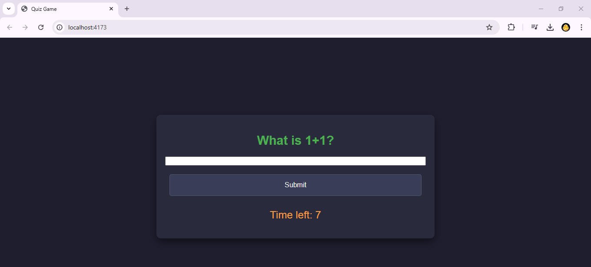
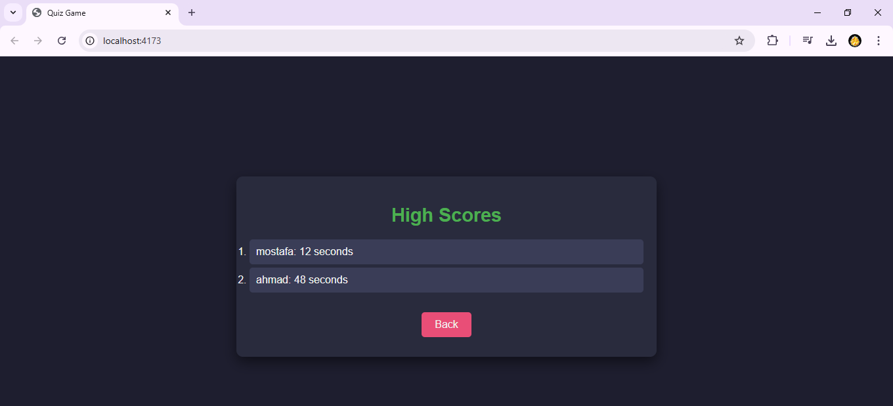

# A2 Quiz

## Overview
A single-page application where users answer quiz questions served dynamically from a RESTful API. The game includes a timer, high-score functionality, and an intuitive user interface.

## Features
- Enter a nickname to start the game.
- Answer each question within 10 seconds:
  - Type your answer for text-based questions.
  - Select an option for multiple-choice questions.
- Game ends if time runs out or you answer incorrectly.
- Displays a victory screen and records your time if you complete all questions.
- Top 5 scores are stored locally and displayed in the high-score list.

## Game Rules
1. Each question must be answered within 10 seconds.
2. Text-based questions require manual input, while multiple-choice questions can be answered by clicking options.
3. High scores are saved locally and ranked by total completion time.

## Getting Started
1. Clone this repository:
```bash:
   git clone [paste the URL here]
```

2. Install dependencies:
```
   npm install
```

3. Run the development server:
```
   npm run dev
```

4. Access the game in your browser at:
```

   http://localhost:4173

```

## Build and Deployment
1. Build the project:
   npm run build

2. Serve the built files:
   npm run serve

3. Alternatively, run the HTTP server:
   npm run http-server dist

## High Scores
The game stores the top 5 quickest completions locally. You can view the high scores anytime from the main menu.

## Screenshots
1. **Start Screen**
       
2. **Question Screen**
    
3. **High-Score Screen**
    
